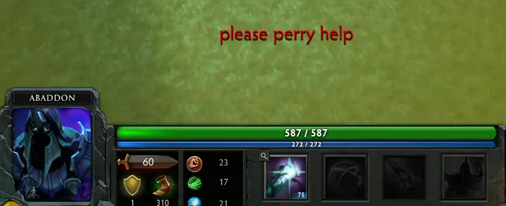
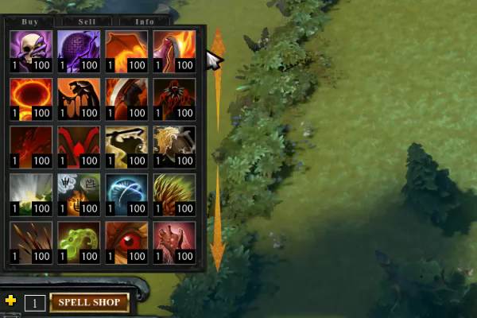
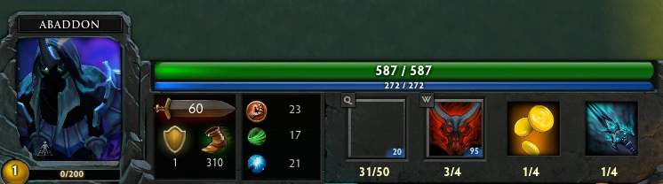

Dota2学习记录
===================

    这只是简单记录自己做Dota2自定义地图的过程。  
    希望自己能坚持下来。  
    　　　　　　　　　　　　　　　　2014.08.22
  
-------------------

| <a name="index"/>目录
| ------------
| [Sublime Text 补全插件](#SublimeText)
| [关于KV文件：技能，单位等](#KV)
| [关于特效](#Particle)
| [关于UI的范例](#UI)

Sublime Text 补全插件 <a name="SublimeText"/>
------------------------
* [Dota Lua Snippet Package V 2.0](https://github.com/bhargavrpatel/Dota-2-Sublime-Packages)

* [Dota 2 KV Package](https://github.com/bhargavrpatel/dota_kv)

[`↑TOP`](#index)

关于KV文件：技能，单位等 <a name="KV"/>
------------------------
* [KV文件参数(略全)](http://hex6.se/dota/)

* [技能 modifier 的参数范例](http://hex6.se/dota/modifier_functions.txt)
* [单位属性，掉落物品](https://github.com/XavierCHN/newfrosty/blob/master/scripts/npc/npc_units_custom.txt#L4149)

[`↑TOP`](#index)

关于特效 <a name="Particle"/>
------------------------
* [浮动伤害数字（伤害，金钱等）](http://www.reddit.com/r/Dota2Modding/comments/2fh49i/floating_damage_numbers_and_damage_block_gold/) [[+备份]](https://github.com/F1rstDan/Dota2RPG_learning/blob/master/%E6%94%B6%E9%9B%86%E7%9A%84%E6%96%87%E4%BB%B6/%E6%B5%AE%E5%8A%A8%E4%BC%A4%E5%AE%B3%E6%95%B0%E5%AD%97%EF%BC%88%E4%BC%A4%E5%AE%B3%EF%BC%8C%E9%87%91%E9%92%B1%E7%AD%89%EF%BC%89.lua)

[`↑TOP`](#index)

关于UI的范例 <a name="UI"/>
------------------------
* [【自定义UI的教程总集】](http://yrrep.me/dota/)  
[- 汉化教程](http://www.dota2rpg.com/forum.php?mod=viewthread&tid=1250&fromuid=395)

* [Legonds Of Dota的技能选择界面](https://github.com/XavierCHN/LegendsOfDota/tree/master/lod/HudSRC)

* [【教程】自定义错误提示](https://developer.valvesoftware.com/wiki/Dota_2_Workshop_Tools:zh-cn/Custom_UI:zh-cn/Custom_Error_Tutorial:zh-cn)  
[- GitHub源代码](https://github.com/zedor/CustomError/)  

* [法术商店 UI](https://github.com/zedor/SpellShop_UI)  

* [PipNumbers (根据熟练度改变技能等级)](https://github.com/zedor/PipNumbers)

[`↑TOP`](#index)
